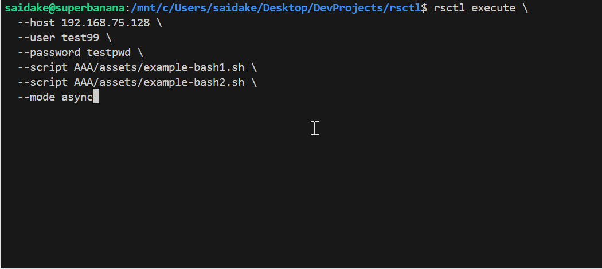
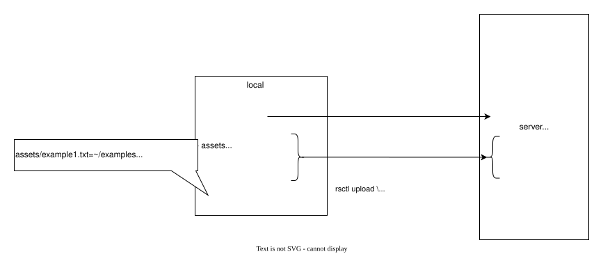
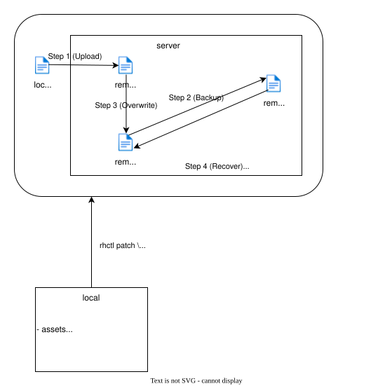

# rsctl (Remote Server Control)


----
**rsctl (Remote Server Control)** is a lightweight, high-performance CLI tool for remote server management. It supports real-time streaming logs, SSH-based file transfers, script execution, file patching, and environment setup using Bash scripts.
# Preview
 
# Table of Contents
- [rsctl (Remote Server Control)](#rsctl-remote-server-control)
- [Preview](#preview)
- [Table of Contents](#table-of-contents)
- [Build](#build)
- [Commands](#commands)
  - [rsctl execute](#rsctl-execute)
  - [rsctl upload](#rsctl-upload)
  - [rsctl patch](#rsctl-patch)
  - [rsctl run](#rsctl-run)
- [Environment Setup Scripts](#environment-setup-scripts)
  - [Docker and Docker Compose](#docker-and-docker-compose)
    - [Installing on a Remote Linux Host](#installing-on-a-remote-linux-host)
  - [Docker Desktop](#docker-desktop)
    - [Installing on Local Windows](#installing-on-local-windows)
  - [AWS LocalStack](#aws-localstack)
    - [Installing on a Remote Linux Host](#installing-on-a-remote-linux-host-1)
  - [MailHog](#mailhog)
    - [Installing on Local Windows](#installing-on-local-windows-1)
  - [Redis](#redis)
    - [Installing on a Remote Linux Host](#installing-on-a-remote-linux-host-2)
  - [MongoDB](#mongodb)
    - [Installing on a Remote Linux Host](#installing-on-a-remote-linux-host-3)
  - [PostgreSQL](#postgresql)
    - [Installing on a Remote Linux Host](#installing-on-a-remote-linux-host-4)
# Build
```bash
cd main && cargo build --release
# Temporarily add `rsctl` to your PATH for the current terminal session.
export PATH="$(pwd)/target/release:$PATH"
```
# Commands
## rsctl execute
[Back to Top](#table-of-contents)  
Runs one or more local Bash scripts on a remote server in a specified working directory.

**Usage**
```bash
rsctl execute \
  --host <host> \
  --user <user> \
  [--ssh-port <port>] \
  [--password <pass>] \
  [--identity <key>] \
  [--certificate <cert>] \
  --script <script1> \
  [--script <script2> ...] \
  [--work-path <path>] \
  [--mode sync|async] \
  [options]
```
**Example**:
```bash
rsctl execute \
  --host 192.168.75.128 \
  --user test99 \
  --script assets/example-bash1.sh \
  --script assets/example-bash2.sh \
  --mode async \
  --use-sudo
```

**Example Script** (e.g., `assets/example-bash1.sh`):
```bash
#!/bin/bash
pwd
echo "Remote Execution 1.1"
sleep 6
echo "Remote Execution 1.2"
```

**Required Parameters**:
- `--host <ip/hostname>`: Remote host IP or hostname
- `--user <username>`: Remote username
- `--script <path>`: Local bash script file (supports multiple)

**Optional Parameters**:
- `--mode <sync|async>`: Execution mode: 'sync' (run sequentially) or 'async' (run concurrently).
- `--work-path <path>`: Remote working directory where the bash script will be executed (defaults to the user's home directory: ~).

- `--password <password>`: Remote password (optional when `--identity` is set; also used for sudo and as a private-key passphrase fallback).
- `--identity <path>`: Path to SSH private key. Preferred over password when set.
- `--certificate <path>`: Path to OpenSSH certificate (requires `--identity`).
- `--ssh-port <port>`: Remote SSH port (default: 22).

- `--use-sudo`: Run operations with sudo (default: false).
- `--use-rsync`: Prefer rsync over scp if available (default: false).
- `--silent`: Suppress prompts. Warning: Use with caution; all overwrite and delete operations will be assumed confirmed (default: false).

- `--connect-timeout <duration>`: Maximum time allowed to establish a connection to the remote server.  
  Example duration values: `20s`, `5m`, `1h`

- `--max-sessions-per-server <num>`: Maximum number of active SSH sessions allowed per server.
- `--max-channels-per-session <num>`: Maximum number of concurrent channels allowed per SSH session. 
- `--session-acquire-timeout <duration>`: Maximum time to wait for acquiring a session from the session pool.  
  Example duration values: `20s`, `5m`, `1h`
- `--max-session-lifetime <duration>`: Maximum lifetime of an SSH session before it is automatically closed.  
  Example duration values: `20s`, `5m`, `1h`

**Optional Global Parameters**:
- `--log_level <level>`: Set log level (debug, info, warn, error; default: info).
- `--var KEY=VALUE`: Provide global variables used in the provided paths (multiple allowed; overrides in YAML mode are ignored).  
  Example:
  ```bash
  rsctl execute \
    --host 192.168.75.128 \
    --user test99 \
    --script '${ASSETS_ROOT}/example-bash1.sh' \
    --script '${ASSETS_ROOT}/example-bash2.sh' \
    --var ASSETS_ROOT=/mnt/c/Users/saidake/Desktop/DevProjects/rsctl/assets \
    --mode async
  ```


## rsctl upload
[Back to Top](#table-of-contents)  
Upload multiple files or all contents of a directory to a remote directory in parallel, based on a properties file.

 

**Usage**
```bash
rsctl upload \
  --host <host> \
  --user <user> \
  [--ssh-port <port>] \
  [--password <pass>] \
  [--identity <key>] \
  [--certificate <cert>] \
  --properties-file <props> \
  [options]
```

**Properties File Format**:
```properties
assets/example1.txt=~/examples
assets/exampledir=~/examples/targetdir
```
Format: `<local-path>=<remote-directory>`    

Maps local files or directories to target directories on the remote server.   

Note: The right-hand side must be a **directory**, not a file path. If it does not exist, it will be created automatically.  
Note: The file or the contents of the local directory on the left will be uploaded **into** the specified remote directory on the right.


**Example**:
```bash
rsctl upload \
  --host 192.168.75.128 \
  --user test99 \
  --properties-file config/path-mapping.properties
```

**Required Parameters**:
- `--host <ip/hostname>`: Remote host IP or hostname
- `--user <username>`: Remote username
- `--properties-file <path>`: Required; defines mappings.

**Optional Parameters**:
- `--password <password>`: Remote password (optional when `--identity` is set; also used for sudo and as a private-key passphrase fallback)
- `--identity <path>`: Path to SSH private key. Preferred over password when set.
- `--certificate <path>`: Path to OpenSSH certificate (requires `--identity`).
- `--ssh-port <port>`: Remote SSH port (default: 22)

- `--use-sudo`: Run operations with sudo (default: false).
- `--use-rsync`: Prefer rsync over scp if available (default: false).
- `--silent`: Suppress prompts. Warning: Use with caution; all overwrite and delete operations will be assumed confirmed (default: false).

- `--connect-timeout <duration>`: Maximum time allowed to establish a connection to the remote server.  
  Example duration values: `20s`, `5m`, `1h`

- `--max-sessions-per-server <num>`: Maximum number of active SSH sessions allowed per server.
- `--max-channels-per-session <num>`: Maximum number of concurrent channels allowed per SSH session. 
- `--session-acquire-timeout <duration>`: Maximum time to wait for acquiring a session from the session pool.  
  Example duration values: `20s`, `5m`, `1h`
- `--max-session-lifetime <duration>`: Maximum lifetime of an SSH session before it is automatically closed.  
  Example duration values: `20s`, `5m`, `1h`

**Optional Global Parameters**:
- `--log_level <level>`: Set log level (debug, info, warn, error; default: info).
- `--var KEY=VALUE`: Provide global variables used in the provided paths (multiple allowed; overrides in YAML mode are ignored).  
  Example:  
    ```properties
    ${ASSETS_ROOT}/example1.txt=~/examples
    ${ASSETS_ROOT}/exampledir=~/examples/targetdir
    ```
    ```bash
    rsctl upload \
      --host 192.168.75.128 \
      --user test99 \
      --ssh-port 22 \
      --use-sudo \
      --properties-file assets/path-mapping.properties \
      --var ASSETS_ROOT=/mnt/c/Users/saidake/Desktop/DevProjects/rsctl/assets
    ```

## rsctl patch
[Back to Top](#table-of-contents)  
Safely patches a remote file by uploading a local patch file, backing up the target file, and applying the patch, or recovering from a backup. 

 

**Usage**
```bash
rsctl patch \
  --host <host> \
  --user <user> \
  [--ssh-port <port>] \
  [--password <pass>] \
  [--identity <key>] \
  [--certificate <cert>] \
  --local-path <path> \
  --remote-upload <path> \
  --remote-path <path> \
  --remote-backup <path> \
  [--recover] \
  [options]
```
Steps (Patch Mode):
1. Upload `local-path` to `remote-upload`.
2. Backup `remote-path` to `remote-backup`.
3. Overwrite `remote-path` with `remote-upload`.

Steps (Recover Mode):
1. Restore `remote-path` from `remote-backup`.

**Example**:
```bash
rsctl patch \
  --host 192.168.75.128 \
  --user test99 \
  --local-path "assets/example-patch.txt" \
  --remote-upload "/tmp/example-patch.txt.upload" \
  --remote-path "~/examples/example-patch-remote.txt" \
  --remote-backup "/tmp/example-patch-remote.txt.bak" 
```

**Required Parameters**:
- `--host <ip/hostname>`: Remote host IP or hostname.
- `--user <username>`: Remote username.
- `--local-path <path>`: Local source file.
- `--remote-upload <path>`: Remote path to upload the local source file.
- `--remote-path <path>`: Remote target file to apply the patch to.
- `--remote-backup <path>`: Backup path for the remote target file before patching.

**Optional Parameters**:
- `--recover`: Recover the remote target file from its backup after a patching.
- `--password <password>`: Remote password (optional when `--identity` is set; also used for sudo and as a private-key passphrase fallback)
- `--identity <path>`: Path to SSH private key. Preferred over password when set.
- `--certificate <path>`: Path to OpenSSH certificate (requires `--identity`).
- `--ssh-port <port>`: Remote SSH port (default: 22)

- `--use-sudo`: Run operations with sudo (default: false).
- `--use-rsync`: Prefer rsync over scp if available (default: false).
- `--silent`: Suppress prompts. Warning: Use with caution; all **overwrite** and **delete** operations will be assumed confirmed (default: false).

- `--connect-timeout <duration>`: Maximum time allowed to establish a connection to the remote server.  
  Example duration values: `20s`, `5m`, `1h`

- `--max-sessions-per-server <num>`: Maximum number of active SSH sessions allowed per server.
- `--max-channels-per-session <num>`: Maximum number of concurrent channels allowed per SSH session. 
- `--session-acquire-timeout <duration>`: Maximum time to wait for acquiring a session from the session pool.  
  Example duration values: `20s`, `5m`, `1h`
- `--max-session-lifetime <duration>`: Maximum lifetime of an SSH session before it is automatically closed.  
  Example duration values: `20s`, `5m`, `1h`


## rsctl run
[Back to Top](#table-of-contents)  
Run batch operations defined in YAML config file. Supports multiple upload/execute/patch tasks across servers/groups in parallel.

**Usage**:
```bash
rsctl run --config <yml-file-path> --config-name <name>
```
**Example**:
```bash
rsctl run  --config config.yml --config-name dev-deploy
```

**YAML Configuration File Format**:
```yaml
# Server-specific configuration
# Can override common config values per server
servers:
  - name: "test-server1"
    host: "192.168.75.128"
    user: "test99"
    ssh-port: 22
    password: "testpwd"
    # identity-file: "~/.ssh/id_ed25519"
    # certificate-file: "~/.ssh/id_ed25519-cert.pub"
    connect_timeout: 60s  # Overrides common server config if specified
  - name: "test-server2"
    host: "192.168.75.129"
    user: "test99"
    ssh-port: 22
    password: "testpwd"
    connect_timeout: 60s  

# Command configurations
# Define sets of upload, patch, execute operations
configs:   
  - name: "dev-deploy"   
    
    # General command options (applied to all operations in this config)
    use-sudo: false
    use-rsync: false
    silent: false
    
    upload:
      - properties-file: "config/path-mapping.properties"

        # Specify which servers or groups this command targets
        target-servers: ["test-server1","test-server2"] 
        # target-groups: ["dev"]
        
        # Override common/general options for this command
        # use-sudo: false
        # use-rsync: false
        # silent: false

    patch:
      - local-path: "assets/example-patch.txt"
        remote-upload: "/tmp/example-patch.txt.upload"
        remote-path: "~/examples/example-patch-remote.txt"
        remote-backup: "/tmp/example-patch-remote.txt.bak"
        target-servers: ["test-server1","test-server2"]  
        # target-groups: ["dev"]

    execute:
      - remote-path: "~"
        scripts: 
          - "assets/example-bash1.sh"
          - "assets/example-bash2.sh"
        mode: sync
        target-servers: ["test-server1","test-server2"]  
        # target-groups: ["dev"]

# Common configuration (Optional)
# Applies to all servers unless overridden in individual server or command configs.
common:
  server:
    connect_timeout: 60s  
    max_channels_per_session: 200
    max_sessions_per_server: 2000
    session_acquire_timeout: 30s
    max_session_lifetime: 10m

# Global variables  (Optional)
# Provide global variables used in the provided paths. 
# Can be referenced in paths using ${VAR_NAME}
var-map:
  ASSETS_ROOT: "/mnt/c/Users/saidake/Desktop/DevProjects/rsctl/assets"

# Group mapping  (Optional)
# Assign servers to logical groups for easier targeting
group-map:
  dev: ["test-server1", "test-server2"]
```

**Required Parameters**:
- `--config <path>`: Path to YAML configuration file
- `--config-name <name>`: Name of the configuration inside the YAML file to use

# Environment Setup Scripts
## Docker and Docker Compose
Docker is a platform that enables you to package, distribute, and run applications in lightweight, portable containers. Docker Compose is a tool for defining and managing multi-container Docker applications using YAML files.

### Installing on a Remote Linux Host
[Back to Top](#table-of-contents)  
**Commands**:
* Installs Docker and Docker Compose on the remote server.

  Check out the script file: [scripts/docker/install.sh](scripts/docker/install.sh)  
  Example:
  ```bash
  rsctl execute \
    --host 192.168.75.128 \
    --user test99 \
    --script scripts/docker/install.sh \
    --use-sudo
  ```

**Example Success Output**:
```
[test99@192.168.75.128][EXECUTE][REMOTE] [INFO] Docker installed successfully: Docker version 28.5.1, build e180ab8
[test99@192.168.75.128][EXECUTE][REMOTE] [INFO] Downloading latest Docker Compose binary...
[test99@192.168.75.128][EXECUTE][REMOTE] [INFO] Docker Compose binary already exists, skipping download.
[test99@192.168.75.128][EXECUTE][REMOTE] [INFO] Verifying Docker Compose installation...
[test99@192.168.75.128][EXECUTE][REMOTE] [INFO] Docker Compose installed successfully: Docker Compose version v2.39.1
[test99@192.168.75.128][EXECUTE][REMOTE] [INFO] Installation complete.
```

## Docker Desktop
Docker Desktop is an easy-to-install application for building, sharing, and running containerized applications on Windows and Mac.

### Installing on Local Windows
[Back to Top](#table-of-contents)  
**Prerequisites**:
1. Open Command Prompt with administrator privileges and navigate to the project root directory.

**Command**:
* Installs Docker Desktop locally on Windows.
  
  Check out the script file: [scripts\docker\install.bat](scripts\docker\install.bat)
  ```bash
  call scripts\docker\install.bat
  ```

## AWS LocalStack
LocalStack is a local AWS cloud stack emulator for testing AWS services.

### Installing on a Remote Linux Host
[Back to Top](#table-of-contents)  
**Prerequisites**:
1. Docker and Docker Compose are installed on the remote server (see [Docker and Docker Compose](#docker-and-docker-compose)).

**Commands** (YAML/Run Mode Example):
* Uploads `scripts/aws/assets/docker-compose.yml` to remote directory `/opt/sandbox/aws`.

  Check out the properties file: [scripts/aws/config/path-mapping.properties](scripts/aws/config/path-mapping.properties)  
  Example:
  ```bash
  rsctl upload \
    --host 192.168.75.128 \
    --user test99 \
    --properties-file scripts/aws/config/path-mapping.properties \
    --use-sudo
  ```
* Start LocalStack.

  Check out the script file: [scripts/aws/localstack-start.sh](scripts/aws/localstack-start.sh)  
  Example:
  ```bash
  rsctl execute \
    --host 192.168.75.128 \
    --user test99 \
    --script scripts/aws/localstack-start.sh \
    --use-sudo
  ```
* Stop LocalStack.
  
  Check out the script file: [scripts/aws/localstack-stop.sh](scripts/aws/localstack-stop.sh)  
  Example:
  ```bash
  rsctl execute \
    --host 192.168.75.128 \
    --user test99 \
    --script scripts/aws/localstack-stop.sh \
    --use-sudo
  ```
## MailHog
MailHog is a lightweight email testing tool that acts as a local SMTP server.

### Installing on Local Windows
[Back to Top](#table-of-contents)  
**Prerequisites**:
1. Docker Desktop is installed and running (see [Docker Desktop](#docker-desktop)).

**Commands**:
* Installs and runs the MailHog Docker image.
  
  Check out the script file: [scripts\mailhog\start.bat](scripts\mailhog\start.bat)  
  Example:
  ```bash
  call scripts\mailhog\start.bat
  ```
* Stops the MailHog Docker image.
  
  Check out the script file: [scripts\mailhog\stop.bat](scripts\mailhog\stop.bat)  
  Example:
  ```bash
  call scripts\mailhog\stop.bat
  ```

**Access**:
- SMTP server: http://localhost:1025
- Web UI: http://localhost:8025

## Redis

### Installing on a Remote Linux Host
**Commands**:
* Installs Redis on the remote server.

  Check out the script file: [scripts/redis/install.sh](scripts/redis/install.sh)  
  Example of installing Redis on Ubuntu (Noble):
  ```bash
  rsctl execute \
    --host 192.168.75.128 \
    --user test99 \
    --password testpwd \
    --script scripts/redis/install.sh \
    --use-sudo
  ```

## MongoDB

### Installing on a Remote Linux Host
[Back to Top](#table-of-contents)  
**Commands**:
* Installs MongoDB on the remote server.

  Check out the script file: [scripts/mongodb/install.sh](scripts/mongodb/install.sh)  
  Example of installing MongoDB on Ubuntu (Noble):
  ```bash
  rsctl execute \
    --host 192.168.75.128 \
    --user test99 \
    --password testpwd \
    --script scripts/mongodb/install.sh \
    --use-sudo
  ```

## PostgreSQL

### Installing on a Remote Linux Host
[Back to Top](#table-of-contents)  
**Commands**:
* Installs PostgreSQL on the remote server.

  Check out the script file: [scripts/postgresql/install.sh](scripts/postgresql/install.sh)  
  Example of installing PostgreSQL on Ubuntu (Noble):
  ```bash
  rsctl execute \
    --host 192.168.75.128 \
    --user test99 \
    --password testpwd \
    --script scripts/postgresql/install.sh \
    --use-sudo
  ```