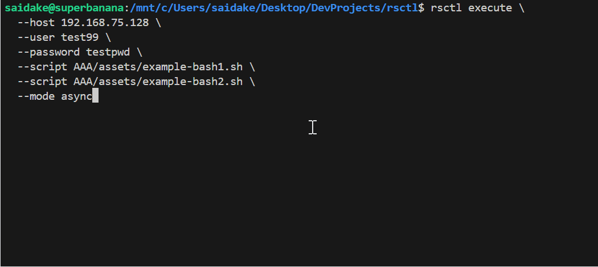
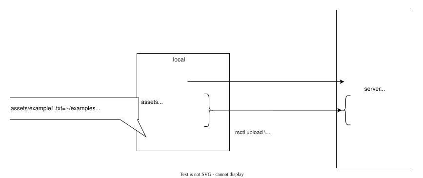
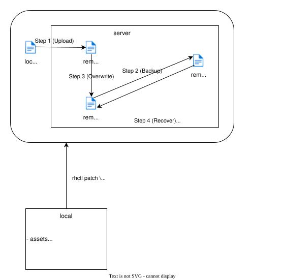

# rhctl (Remote Host Control)


----
**rhctl (Remote Host Control)** is a lightweight, high-performance CLI tool for remote host management. It supports real-time streaming logs, SSH-based file transfers, script execution, file patching, and environment setup using Bash scripts.
# Preview
 
# Table of Contents
- [rhctl (Remote Host Control)](#rhctl-remote-host-control)
- [Preview](#preview)
- [Table of Contents](#table-of-contents)
- [Install](#install)
- [Build](#build)
- [Commands](#commands)
  - [rhctl execute](#rhctl-execute)
  - [rhctl upload](#rhctl-upload)
  - [rhctl patch](#rhctl-patch)
  - [rhctl run](#rhctl-run)
- [SSH Authentication Setup](#ssh-authentication-setup)
  - [Add Your Public Key to a Remote Server](#add-your-public-key-to-a-remote-server)
- [Environment Setup Scripts](#environment-setup-scripts)
  - [Docker and Docker Compose](#docker-and-docker-compose)
    - [Installing on a Remote Linux Host](#installing-on-a-remote-linux-host)
  - [Docker Desktop](#docker-desktop)
    - [Installing on Local Windows](#installing-on-local-windows)
  - [AWS LocalStack](#aws-localstack)
    - [Installing on a Remote Linux Host](#installing-on-a-remote-linux-host-1)
  - [MailHog](#mailhog)
    - [Installing on Local Windows](#installing-on-local-windows-1)
  - [Redis](#redis)
    - [Installing on a Remote Linux Host](#installing-on-a-remote-linux-host-2)
  - [MongoDB](#mongodb)
    - [Installing on a Remote Linux Host](#installing-on-a-remote-linux-host-3)
  - [PostgreSQL](#postgresql)
  - [NATS JetStream](#nats-jetstream)
    - [Installing on a Remote Linux Host](#installing-on-a-remote-linux-host-4)
- [Contributing](#contributing)
# Install
```bash
brew install saidake/rhctl/rhctl
```
Prebuilt binaries are also attached to each [GitHub Release](https://github.com/saidake/rhctl/releases).
# Build
```bash
cd main && cargo build --release && cd ..
# Temporarily add `rhctl` to your PATH for the current terminal session.
export PATH="$(pwd)/main/target/release:$PATH"
# Permanently install the release binary into /usr/local/bin.
sudo cp main/target/release/rhctl /usr/local/bin/rhctl
sudo chmod +x /usr/local/bin/rhctl
```
# Commands
## rhctl execute
[Back to Top](#table-of-contents)  
Runs local Bash scripts and/or remote shell commands on a remote server in a specified working directory.

**Usage**
```bash
rhctl execute \
  --host <host> \
  --user <user> \
  [--ssh-port <port>] \
  [--password <pass>] \
  [--identity <key>] \
  [--certificate <cert>] \
  [--script <script-or-cmdline> ...] \
  [--cmd <remote-command> ...] \
  [--env-extract-regex <regex> --env-name <KEY>] \
  [--work-path <path>] \
  [--mode sync|async] \
  [options]
```
**Example**:
```bash
rhctl execute \
  --host 192.168.75.128 \
  --user test99 \
  --script assets/example-bash1.sh \
  --script assets/example-bash2.sh \
  --mode async \
  --use-sudo
```

**Example with script parameters** (path and args in one `--script` value):
```bash
rhctl execute \
  --host 192.168.75.129 \
  --user test99 \
  --password testpwd \
  --script "/path/to/scripts/postgresql/db.sh --action create --port 5432" \
  --env-extract-regex '\[INFO\][[:space:]]+DATABASE_URL=(.*)' \
  --env-name DB_URL \
  --use-sudo
```

**Example with a direct remote command**:
```bash
rhctl execute \
  --host 192.168.75.128 \
  --user root \
  --cmd "systemctl status nats" \
  --use-sudo
```

**Example Script** (e.g., `assets/example-bash1.sh`):
```bash
#!/bin/bash
pwd
echo "Remote Execution 1.1"
sleep 6
echo "Remote Execution 1.2"
```

**Required Parameters**:
- `--host <ip/hostname>`: Remote host IP or hostname
- `--user <username>`: Remote username
- At least one of:
  - `--script <cmdline>`: Local bash script path, optionally followed by args (shell-style quoting). Supports multiple.
  - `--cmd <command>`: Remote shell command (no local upload). Supports multiple.  
    Example: `--cmd "systemctl status nats"`

**Optional Parameters**:
- `--mode <sync|async>`: Execution mode: 'sync' (run sequentially) or 'async' (run concurrently). Applies to scripts; commands always run sequentially after scripts.
- `--work-path <path>`: Remote working directory (defaults to `~`).
- `--env-extract-regex <regex>` + `--env-name <KEY>`: Must appear together with the **same count**; paired by order. Search clean output lines (skip `\r`), take the **last** match of capture group 1 per regex, upsert each `KEY=value` into remote `/etc/rhctl/.env`. Prefer `--use-sudo` / root.  
  Use **single quotes** around the regex so `\[` / `\]` are not stripped by the shell (double quotes turn `\[INFO\]` into a character class `[INFO]`).  
  Example:
  ```bash
  --env-extract-regex '\[INFO\][[:space:]]+DATABASE_URL=(.*)' \
  --env-name DB_URL \
  --env-extract-regex '\[INFO\][[:space:]]+DB_USER=(.*)' \
  --env-name DB_USER
  ```

- `--password <password>`: Remote password (optional when `--identity` is set; also used for sudo and as a private-key passphrase fallback).
- `--identity <path>`: Path to SSH private key (OpenSSH or PEM). Preferred over password when set.  
  Example path values: `~/.ssh/id_ed25519`, `~/.ssh/id_rsa.pem`
- `--certificate <path>`: Optional OpenSSH certificate (requires `--identity`; not a TLS/X.509 PEM cert).  
  Example path values: `~/.ssh/id_ed25519-cert.pub`
- `--ssh-port <port>`: Remote SSH port (default: 22).

- `--use-sudo`: Run operations with sudo (default: false).
- `--use-rsync`: Prefer rsync over scp if available (default: false).
- `--silent`: Suppress prompts. Warning: Use with caution; all overwrite and delete operations will be assumed confirmed (default: false).

- `--connect-timeout <duration>`: Maximum time allowed to establish a connection to the remote server.  
  Example duration values: `20s`, `5m`, `1h`

- `--max-sessions-per-server <num>`: Maximum number of active SSH sessions allowed per server.
- `--max-channels-per-session <num>`: Maximum number of concurrent channels allowed per SSH session. 
- `--session-acquire-timeout <duration>`: Maximum time to wait for acquiring a session from the session pool.  
  Example duration values: `20s`, `5m`, `1h`
- `--max-session-lifetime <duration>`: Maximum lifetime of an SSH session before it is automatically closed.  
  Example duration values: `20s`, `5m`, `1h`

**Optional Global Parameters**:
- `--debug`: Enable debug logging (default: info).
- Path placeholders `${NAME}` are expanded from the process environment.  
  Example:
  ```bash
  export ASSETS_ROOT=/path/to/assets
  rhctl execute \
    --host 192.168.75.128 \
    --user test99 \
    --script '${ASSETS_ROOT}/example-bash1.sh' \
    --script '${ASSETS_ROOT}/example-bash2.sh' \
    --mode async
  ```


## rhctl upload
[Back to Top](#table-of-contents)  
Upload multiple files or all contents of a directory to a remote directory in parallel, using inline `--transfer` pairs and/or a `--transfer-file`.

 

**Usage**
```bash
rhctl upload \
  --host <host> \
  --user <user> \
  [--ssh-port <port>] \
  [--password <pass>] \
  [--identity <key>] \
  [--certificate <cert>] \
  [--transfer <local=remote-dir> ...] \
  [--transfer-file <file>] \
  [options]
```

**Transfer Format** (`--transfer` or each line in `--transfer-file`):
```properties
assets/example1.txt=~/examples
assets/exampledir=~/examples/targetdir
```
Format: `<local-path>=<remote-directory>`    

Maps local files or directories to target directories on the remote server.   

Note: The right-hand side must be a **directory**, not a file path. If it does not exist, it will be created automatically.  
Note: The file or the contents of the local directory on the left will be uploaded **into** the specified remote directory on the right.  
Note: Provide at least one of `--transfer` or `--transfer-file`. When both are set, the file is loaded first and `--transfer` overrides the same local path.


**Example** (transfer file):
```bash
rhctl upload \
  --host 192.168.75.128 \
  --user test99 \
  --transfer-file config/path-mapping.properties
```

**Example** (inline transfers):
```bash
rhctl upload \
  --host 192.168.75.128 \
  --user test99 \
  --transfer assets/example1.txt=~/examples \
  --transfer assets/exampledir=~/examples/targetdir
```

**Required Parameters**:
- `--host <ip/hostname>`: Remote host IP or hostname
- `--user <username>`: Remote username
- At least one of:
  - `--transfer <local=remote-dir>`: Inline mapping (repeatable)
  - `--transfer-file <path>`: File of `local=remote-dir` lines

**Optional Parameters**:
- `--password <password>`: Remote password (optional when `--identity` is set; also used for sudo and as a private-key passphrase fallback)
- `--identity <path>`: Path to SSH private key (OpenSSH or PEM). Preferred over password when set.  
  Example path values: `~/.ssh/id_ed25519`, `~/.ssh/id_rsa.pem`
- `--certificate <path>`: Optional OpenSSH certificate (requires `--identity`; not a TLS/X.509 PEM cert).  
  Example path values: `~/.ssh/id_ed25519-cert.pub`
- `--ssh-port <port>`: Remote SSH port (default: 22)

- `--use-sudo`: Run operations with sudo (default: false).
- `--use-rsync`: Prefer rsync over scp if available (default: false).
- `--silent`: Suppress prompts. Warning: Use with caution; all overwrite and delete operations will be assumed confirmed (default: false).

- `--connect-timeout <duration>`: Maximum time allowed to establish a connection to the remote server.  
  Example duration values: `20s`, `5m`, `1h`

- `--max-sessions-per-server <num>`: Maximum number of active SSH sessions allowed per server.
- `--max-channels-per-session <num>`: Maximum number of concurrent channels allowed per SSH session. 
- `--session-acquire-timeout <duration>`: Maximum time to wait for acquiring a session from the session pool.  
  Example duration values: `20s`, `5m`, `1h`
- `--max-session-lifetime <duration>`: Maximum lifetime of an SSH session before it is automatically closed.  
  Example duration values: `20s`, `5m`, `1h`

**Optional Global Parameters**:
- `--debug`: Enable debug logging (default: info).
- Path placeholders `${NAME}` are expanded from the process environment.  
  Example:  
    ```properties
    ${ASSETS_ROOT}/example1.txt=~/examples
    ${ASSETS_ROOT}/exampledir=~/examples/targetdir
    ```
    ```bash
    export ASSETS_ROOT=/path/to/assets
    rhctl upload \
      --host 192.168.75.128 \
      --user test99 \
      --ssh-port 22 \
      --use-sudo \
      --transfer-file config/path-mapping.properties
    ```

## rhctl patch
[Back to Top](#table-of-contents)  
Safely patches a remote file by uploading a local patch file, backing up the target file, and applying the patch, or recovering from a backup. 

 

**Usage**
```bash
rhctl patch \
  --host <host> \
  --user <user> \
  [--ssh-port <port>] \
  [--password <pass>] \
  [--identity <key>] \
  [--certificate <cert>] \
  --local-path <path> \
  --remote-upload <path> \
  --remote-path <path> \
  --remote-backup <path> \
  [--recover] \
  [options]
```
Steps (Patch Mode):
1. Upload `local-path` to `remote-upload`.
2. Backup `remote-path` to `remote-backup`.
3. Overwrite `remote-path` with `remote-upload`.

Steps (Recover Mode):
1. Restore `remote-path` from `remote-backup`.

**Example**:
```bash
rhctl patch \
  --host 192.168.75.128 \
  --user test99 \
  --local-path "assets/example-patch.txt" \
  --remote-upload "/tmp/example-patch.txt.upload" \
  --remote-path "~/examples/example-patch-remote.txt" \
  --remote-backup "/tmp/example-patch-remote.txt.bak" 
```

**Required Parameters**:
- `--host <ip/hostname>`: Remote host IP or hostname.
- `--user <username>`: Remote username.
- `--local-path <path>`: Local source file.
- `--remote-upload <path>`: Remote path to upload the local source file.
- `--remote-path <path>`: Remote target file to apply the patch to.
- `--remote-backup <path>`: Backup path for the remote target file before patching.

**Optional Parameters**:
- `--recover`: Recover the remote target file from its backup after a patching.
- `--password <password>`: Remote password (optional when `--identity` is set; also used for sudo and as a private-key passphrase fallback)
- `--identity <path>`: Path to SSH private key (OpenSSH or PEM). Preferred over password when set.  
  Example path values: `~/.ssh/id_ed25519`, `~/.ssh/id_rsa.pem`
- `--certificate <path>`: Optional OpenSSH certificate (requires `--identity`; not a TLS/X.509 PEM cert).  
  Example path values: `~/.ssh/id_ed25519-cert.pub`
- `--ssh-port <port>`: Remote SSH port (default: 22)

- `--use-sudo`: Run operations with sudo (default: false).
- `--use-rsync`: Prefer rsync over scp if available (default: false).
- `--silent`: Suppress prompts. Warning: Use with caution; all **overwrite** and **delete** operations will be assumed confirmed (default: false).

- `--connect-timeout <duration>`: Maximum time allowed to establish a connection to the remote server.  
  Example duration values: `20s`, `5m`, `1h`

- `--max-sessions-per-server <num>`: Maximum number of active SSH sessions allowed per server.
- `--max-channels-per-session <num>`: Maximum number of concurrent channels allowed per SSH session. 
- `--session-acquire-timeout <duration>`: Maximum time to wait for acquiring a session from the session pool.  
  Example duration values: `20s`, `5m`, `1h`
- `--max-session-lifetime <duration>`: Maximum lifetime of an SSH session before it is automatically closed.  
  Example duration values: `20s`, `5m`, `1h`

**Optional Global Parameters**:
- `--debug`: Enable debug logging (default: info).
- Path placeholders `${NAME}` are expanded from the process environment.

## rhctl run
[Back to Top](#table-of-contents)  
Run batch operations defined in a YAML config. Steps under `runs:` execute **in order** (upload → execute → patch as listed). Within each step, target servers run in parallel. A failed step aborts the rest.

**Usage**:
```bash
rhctl run --config <yml-file-path> --config-name <name>
```
**Example**:
```bash
rhctl run  --config config.yml --config-name dev-deploy
```

**YAML Configuration File Format**:
```yaml
# Server-specific configuration
# Can override common config values per server
servers:
  - name: "test-server1"
    host: "192.168.75.128"
    user: "test99"
    ssh-port: 22
    password: "testpwd"
    # identity-file: "~/.ssh/id_ed25519"
    # certificate-file: "~/.ssh/id_ed25519-cert.pub"
    connect_timeout: 60s  # Overrides common server config if specified
  - name: "test-server2"
    host: "192.168.75.129"
    user: "test99"
    ssh-port: 22
    password: "testpwd"
    connect_timeout: 60s  

# Command configurations — ordered pipeline under `runs:`
configs:   
  - name: "dev-deploy"   
    
    # General command options (applied to all steps unless overridden)
    use-sudo: false
    use-rsync: false
    silent: false

    target-servers: ["test-server1","test-server2"] 
    # target-groups: ["dev"]

    var-map: # config-scoped; overrides global var-map / env
      ASSETS_ROOT: "/path/to/assets"

    runs:
      - type: upload
        # transfer-file: "config/path-mapping.properties"
        transfers:
          - "${ASSETS_ROOT}/example1.txt=~/examples"
        # Optional per-step target override:
        # target-servers: ["test-server1"]

      - type: patch
        local-path: "${ASSETS_ROOT}/example-patch.txt"
        remote-upload: "/tmp/example-patch.txt.upload"
        remote-path: "~/examples/example-patch-remote.txt"
        remote-backup: "/tmp/example-patch-remote.txt.bak"

      - type: execute
        work-path: "~"          # alias: remote-path
        scripts: 
          - "${ASSETS_ROOT}/example-bash1.sh"
          - "${ASSETS_ROOT}/example-bash2.sh"
        mode: sync

# Common configuration (Optional)
# Applies to all servers unless overridden in individual server or command configs.
common:
  server:
    connect_timeout: 60s  
    max_channels_per_session: 200
    max_sessions_per_server: 2000
    session_acquire_timeout: 30s
    max_session_lifetime: 10m

# Global variables  (Optional)
# Provide values for ${VAR_NAME} placeholders in paths.
# Entries here are overridden by the same name in a config's var-map.
var-map:
  ASSETS_ROOT: "/path/to/assets"

# Group mapping  (Optional)
# Assign servers to logical groups for easier targeting
group-map:
  dev: ["test-server1", "test-server2"]
```

**Required Parameters**:
- `--config <path>`: Path to YAML configuration file
- `--config-name <name>`: Name of the configuration inside the YAML file to use

# SSH Authentication Setup
[Back to Top](#table-of-contents)  

`rhctl` can authenticate with a password, an SSH private key (`--identity`), or an OpenSSH certificate (`--identity` + `--certificate`). Key-based login is preferred for automation.

- `--identity` accepts an OpenSSH private key or a PEM private key (for example `id_ed25519` or `id_rsa.pem`). If the key is encrypted, pass the passphrase with `--password`.
- `--certificate` is optional when `--identity` is set. Use it only for OpenSSH user certificates (typically `*-cert.pub`), not TLS/X.509 PEM certificates. A certificate always requires `--identity`.

## Add Your Public Key to a Remote Server
Generate a key pair on your local machine (skip if you already have one):

```bash
ssh-keygen -t ed25519 -f ~/.ssh/id_ed25519 -C "rhctl"
```

Copy the **public** key to the remote server (one-time setup; password login is required for this step):

```bash
ssh-copy-id -i ~/.ssh/id_ed25519.pub -p 22 user@192.168.75.128
```

Or install it manually:

```bash
# On the remote server
mkdir -p ~/.ssh && chmod 700 ~/.ssh
echo "PASTE_YOUR_PUBLIC_KEY_HERE" >> ~/.ssh/authorized_keys
chmod 600 ~/.ssh/authorized_keys
```

# Environment Setup Scripts
## Docker and Docker Compose
Docker is a platform that enables you to package, distribute, and run applications in lightweight, portable containers. Docker Compose is a tool for defining and managing multi-container Docker applications using YAML files.

### Installing on a Remote Linux Host
[Back to Top](#table-of-contents)  
**Commands**:
* Installs Docker and Docker Compose on the remote server.

  Check out the script file: [scripts/docker/install.sh](scripts/docker/install.sh)  
  Example:
  ```bash
  rhctl execute \
    --host 192.168.75.128 \
    --user test99 \
    --script scripts/docker/install.sh \
    --use-sudo
  ```

**Example Success Output**:
```
[test99@192.168.75.128][EXECUTE][REMOTE] [INFO] Docker installed successfully: Docker version 28.5.1, build e180ab8
[test99@192.168.75.128][EXECUTE][REMOTE] [INFO] Downloading latest Docker Compose binary...
[test99@192.168.75.128][EXECUTE][REMOTE] [INFO] Docker Compose binary already exists, skipping download.
[test99@192.168.75.128][EXECUTE][REMOTE] [INFO] Verifying Docker Compose installation...
[test99@192.168.75.128][EXECUTE][REMOTE] [INFO] Docker Compose installed successfully: Docker Compose version v2.39.1
[test99@192.168.75.128][EXECUTE][REMOTE] [INFO] Installation complete.
```

## Docker Desktop
Docker Desktop is an easy-to-install application for building, sharing, and running containerized applications on Windows and Mac.

### Installing on Local Windows
[Back to Top](#table-of-contents)  
**Prerequisites**:
1. Open Command Prompt with administrator privileges and navigate to the project root directory.

**Command**:
* Installs Docker Desktop locally on Windows.
  
  Check out the script file: [scripts/docker/install.bat](scripts/docker/install.bat)
  ```bash
  call scripts\docker\install.bat
  ```

## AWS LocalStack
LocalStack is a local AWS cloud stack emulator for testing AWS services.

### Installing on a Remote Linux Host
[Back to Top](#table-of-contents)  
**Prerequisites**:
1. Docker and Docker Compose are installed on the remote server (see [Docker and Docker Compose](#docker-and-docker-compose)).

**Commands** (YAML/Run Mode Example):
* Uploads `scripts/aws/assets/docker-compose.yml` to remote directory `/opt/sandbox/aws`.

  Check out the transfer file: [scripts/aws/config/path-mapping.properties](scripts/aws/config/path-mapping.properties)  
  Example:
  ```bash
  rhctl upload \
    --host 192.168.75.128 \
    --user test99 \
    --transfer-file scripts/aws/config/path-mapping.properties \
    --use-sudo
  ```
* Start LocalStack.

  Check out the script file: [scripts/aws/localstack-start.sh](scripts/aws/localstack-start.sh)  
  Example:
  ```bash
  rhctl execute \
    --host 192.168.75.128 \
    --user test99 \
    --script scripts/aws/localstack-start.sh \
    --use-sudo
  ```
* Stop LocalStack.
  
  Check out the script file: [scripts/aws/localstack-stop.sh](scripts/aws/localstack-stop.sh)  
  Example:
  ```bash
  rhctl execute \
    --host 192.168.75.128 \
    --user test99 \
    --script scripts/aws/localstack-stop.sh \
    --use-sudo
  ```
## MailHog
MailHog is a lightweight email testing tool that acts as a local SMTP server.

### Installing on Local Windows
[Back to Top](#table-of-contents)  
**Prerequisites**:
1. Docker Desktop is installed and running (see [Docker Desktop](#docker-desktop)).

**Commands**:
* Installs and runs the MailHog Docker image.
  
  Check out the script file: [scripts/mailhog/start.bat](scripts/mailhog/start.bat)  
  Example:
  ```bash
  call scripts\mailhog\start.bat
  ```
* Stops the MailHog Docker image.
  
  Check out the script file: [scripts/mailhog/stop.bat](scripts/mailhog/stop.bat)  
  Example:
  ```bash
  call scripts\mailhog\stop.bat
  ```

**Access**:
- SMTP server: http://localhost:1025
- Web UI: http://localhost:8025

## Redis

### Installing on a Remote Linux Host
**Commands**:
* Installs Redis on the remote server.

  Check out the script file: [scripts/redis/install.sh](scripts/redis/install.sh)  
  Example of installing Redis on Ubuntu (Noble):
  ```bash
  rhctl execute \
    --host 192.168.75.128 \
    --user test99 \
    --password testpwd \
    --script scripts/redis/install.sh \
    --use-sudo
  ```

## MongoDB

### Installing on a Remote Linux Host
[Back to Top](#table-of-contents)  
**Commands**:
* Installs MongoDB on the remote server.

  Check out the script file: [scripts/mongodb/install.sh](scripts/mongodb/install.sh)  
  Example of installing MongoDB on Ubuntu (Noble):
  ```bash
  rhctl execute \
    --host 192.168.75.128 \
    --user test99 \
    --password testpwd \
    --script scripts/mongodb/install.sh \
    --use-sudo
  ```

## PostgreSQL

### Installing on a Remote Linux Host
[Back to Top](#table-of-contents)  
**Commands**:
* Installs PostgreSQL on the remote server.

  Check out the script file: [scripts/postgresql/install.sh](scripts/postgresql/install.sh)  
  Example of installing PostgreSQL on Ubuntu (Noble):
  ```bash
  rhctl execute \
    --host 192.168.75.128 \
    --user test99 \
    --password testpwd \
    --script scripts/postgresql/install.sh \
    --use-sudo
  ```
* Configures PostgreSQL for remote access (listen, port, pg_hba, firewall).

  Check out the script file: [scripts/postgresql/configure.sh](scripts/postgresql/configure.sh)  
  Example:
  ```bash
  rhctl execute \
    --host 192.168.75.128 \
    --user test99 \
    --password testpwd \
    --script "scripts/postgresql/configure.sh --port 5432" \
    --use-sudo
  ```
* Creates / lists / deletes databases and roles (`db.sh --action create|list|delete`).

  Check out the script file: [scripts/postgresql/db.sh](scripts/postgresql/db.sh)  
  Example create:
  ```bash
  rhctl execute \
    --host 192.168.75.128 \
    --user test99 \
    --password testpwd \
    --script "scripts/postgresql/db.sh --action create --port 5432" \
    --use-sudo
  ```
  Example list:
  ```bash
  rhctl execute \
    --host 192.168.75.128 \
    --user test99 \
    --password testpwd \
    --script "scripts/postgresql/db.sh --action list --port 5432" \
    --use-sudo
  ```
  Example delete:
  ```bash
  rhctl execute \
    --host 192.168.75.128 \
    --user test99 \
    --password testpwd \
    --script "scripts/postgresql/db.sh --action delete --db-name mydb --port 5432" \
    --use-sudo
  ```

## NATS JetStream
NATS Server with JetStream enabled for persistent messaging streams.

### Installing on a Remote Linux Host
[Back to Top](#table-of-contents)  
**Commands**:
* Installs NATS Server with JetStream and configures a systemd `nats` service (idempotent).

  Check out the script file: [scripts/jetstream/install.sh](scripts/jetstream/install.sh)  
  Example of installing NATS JetStream on Ubuntu:
  ```bash
  rhctl execute \
    --host 192.168.75.128 \
    --user test99 \
    --password testpwd \
    --script scripts/jetstream/install.sh \
    --use-sudo
  ```
  Example using an existing archive already on the remote host (skips curl download):
  ```bash
  rhctl execute \
    --host 192.168.75.128 \
    --user test99 \
    --password testpwd \
    --script "scripts/jetstream/install.sh --archive /home/test99/nats-server-v2.15.0-linux-amd64.tar.gz" \
    --use-sudo
  ```
* Configures NATS for remote access (listen on all interfaces, open firewall port, print connection URL).

  Check out the script file: [scripts/jetstream/configure.sh](scripts/jetstream/configure.sh)  
  Example:
  ```bash
  rhctl execute \
    --host 192.168.75.128 \
    --user test99 \
    --password testpwd \
    --script "scripts/jetstream/configure.sh --port 4222" \
    --use-sudo
  ```

**Example Success Output** (install):
```
[test99@192.168.75.128][EXECUTE][REMOTE] [INFO] NATS already installed: nats-server: v2.12.5
[test99@192.168.75.128][EXECUTE][REMOTE] [INFO] User 'nats' already exists.
[test99@192.168.75.128][EXECUTE][REMOTE] [INFO] NATS config already exists: /etc/nats/nats.conf
[test99@192.168.75.128][EXECUTE][REMOTE] [INFO] systemd service already exists.
[test99@192.168.75.128][EXECUTE][REMOTE] [INFO] NATS service already enabled.
[test99@192.168.75.128][EXECUTE][REMOTE] [INFO] NATS service already running.
[test99@192.168.75.128][EXECUTE][REMOTE] [INFO] NATS service is running.
[test99@192.168.75.128][EXECUTE][REMOTE] [INFO] Installation complete.
```

**Example Success Output** (configure):
```
[test99@192.168.75.128][EXECUTE][REMOTE] [INFO] Updated nats.conf 'host' = 0.0.0.0
[test99@192.168.75.128][EXECUTE][REMOTE] [INFO] nats.conf 'port' already set to 4222
[test99@192.168.75.128][EXECUTE][REMOTE] [INFO] Allowed 4222/tcp in ufw
[test99@192.168.75.128][EXECUTE][REMOTE] [INFO] Restarting NATS to apply config
[test99@192.168.75.128][EXECUTE][REMOTE] [INFO] NATS service is running
[test99@192.168.75.128][EXECUTE][REMOTE] =============================================
[test99@192.168.75.128][EXECUTE][REMOTE] [INFO] NATS JetStream connection
[test99@192.168.75.128][EXECUTE][REMOTE] [INFO]   NATS_HOST=<host>
[test99@192.168.75.128][EXECUTE][REMOTE] [INFO]   NATS_PORT=4222
[test99@192.168.75.128][EXECUTE][REMOTE] [INFO]   NATS_URL=nats://<host>:4222
[test99@192.168.75.128][EXECUTE][REMOTE] =============================================
```

# Contributing
If you would like to contribute to the code base or fix an issue, please see [CONTRIBUTING.md](CONTRIBUTING.md).